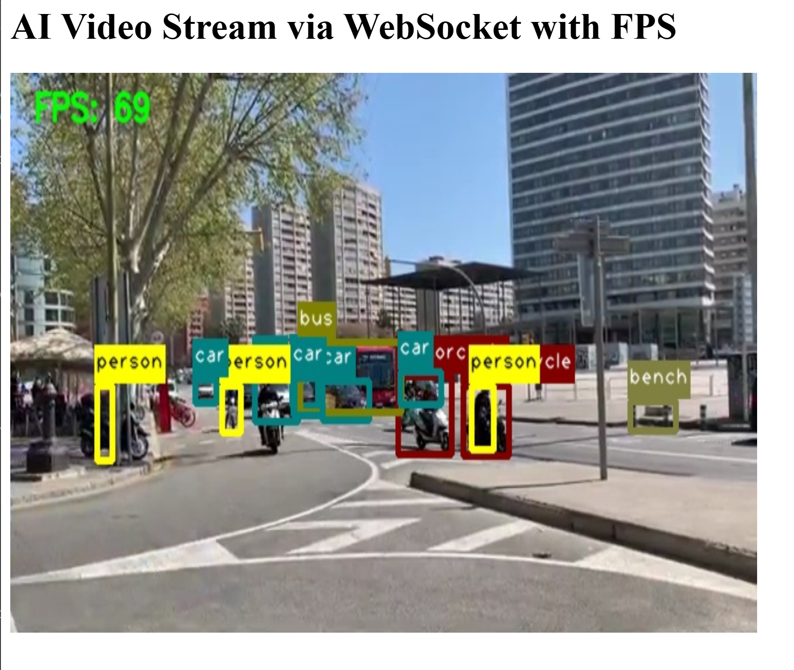

<h3 style="color: red;">🚧 Disclaimer: This project is a work in progress. Please do not use the code yet.</h3>


I'm building a user-friendly, real-time video loop web application called **`Web_app`**, which performs object detection using a Hailo model on a Raspberry Pi 5.

It uses a **WebRTC-based** stream to send video frames from the user to the server and back. WebRTC (~50 ms latency) is much faster than WebSocket-based solutions (~150 ms).


**In brief:**  
The browser capture camera frames and streams them to the server using WebRTC. The server runs object detection and streams the annotated video back to the user.

**Video demonstration:**

*(Add your video link here)*

---

Install **WebRTC-based**:
```bash
pip install aiortc
```
Install **python-multipart**:

- To read uploaded files sent by the user browser. 
```bash
pip install python-multipart
```

> Make sure that you have ``ffmpeg`` installed system-wide

**Check that you have ``ffmpeg``**

```bash
ffmpeg -version`
```
**if not installed then run:** 

```bash
sudo apt update
sudo apt install ffmpeg
```

Then, go to the file directory ``Web_app`` using ``cd <path>``.

**Run the FastAPI Server**:
   ```bash
   uvicorn main:app --host 0.0.0.0 --port 8000
   ```

**Access the Video Stream**:
   - Open a web browser and navigate to `http://127.0.0.1:8001/` to view the AI-processed video stream.

## Raspberry Pi 5 Running Hailo Model with a FastAPI Server 

 I’m using a Raspberry Pi 5 with a Hailo AI chip to detect objects in a video and stream the results live to a web page. All processing is done locally on the device using a Raspberry Pi 5 with the Hailo8L AI accelerator

I'm still in development, so the HTML UI is not finished yet. I’ve only set it up for quick prototyping.

I'm still testing whether WebSocket is faster than HTTP with the MJPEG format. So far, I'm getting about **double the performance using WebSocket**.

If you find a mistake, feel free to drop a comment or open an issue on GitHub. Thanks!

## Screenshot of a Video Stream via WebSocket


I load the YOLOv8 model tailored for the Hailo8L device using the [DeGirum SDK](https://github.com/DeGirum/hailo_examples).

## Demo 1 using Hailo Yolo11 nano model


## Demo 2 using Hailo Yolo8 nano model


## **Repository Structure**

The `HTTP` directory contains the **HTTP Streaming**: Streams the processed video frames to clients using the MJPEG format via FastAPI routes.


The `WebSocket` directory contains the **WebSocket Streaming**: Streams that processed video frames to clients using the WebSocket via FastAPI routes.

The `Webcam` directory contains the **Webcam Streaming**: Streams that processed video frames to clients using WebSocket via FastAPI routes.


## **Functionality Overview**

1. **Initialize the AI Model**:  
   - Load the YOLOv8n/YOLOv11n Hailo model tailored for the Hailo8L device using the [DeGirum SDK](https://github.com/DeGirum/hailo_examples).  
   - Configure the model with appropriate parameters such as inference host address and device types using the [DeGirum SDK](https://github.com/DeGirum/hailo_examples).

2. **Process Video Input**:  
   - Open a video file or stream as the input source.  
   - Read frames sequentially, perform object detection inference on each frame, and overlay the detection results on **bounding boxes and labels** using [DeGirum SDK](https://github.com/DeGirum/hailo_examples).

3. **Stream Processed Video**:  
   - Serve the processed frames over HTTP or WebSocket using FastAPI.  
   - Implement an endpoint in order to view the real-time video stream with inference results.

   
## **Setting Up and Running the Application**

To set up and run the application:


1. **Install DeGirum SDK**:
   - Do the guided installation for [DeGirum SDK](https://github.com/DeGirum/hailo_examples).


2. **Activate the virtual environment**:
   ```bash
   source degirum_env/bin/activate
   ```

3. **Install requirements dependencies**
   ```bash
   pip install fastapi uvicorn degirum degirum_tools
   ```

4. **Clone my repo**:
   ```bash
   git clone https://github.com/PiWebswiss/raspberry_PI5_hailo.git
   cd raspberry_PI5_hailo
   ```

   >Then, go to the file directory `Webcam` ,``WebSocket`` or ``HTTP`` using ``cd <path>``.

5. **Run the FastAPI Server**:
   ```bash
   uvicorn main:app --host 0.0.0.0 --port 8000
   ```

6. **Access the Video Stream**:
   - Open a web browser and navigate to `http://127.0.0.1:8001/` to view the AI-processed video stream.

## **Additional Notes**

- **Hardware Requirements**:  
  - A Raspberry Pi 5 with the Hailo8L AI accelerator.


