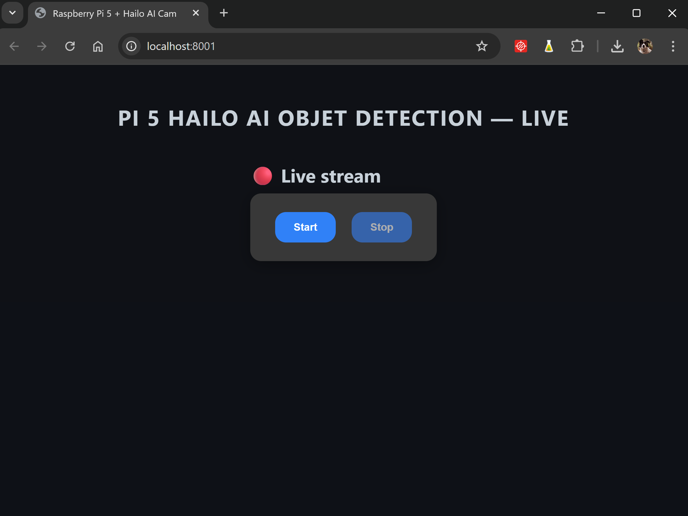

# Raspberry Pi 5 with Hailo AI and FastAPI

This project uses a Raspberry Pi 5 equipped with a Hailo AI accelerator to perform real-time object detection on video streams and broadcast the annotated output to a web page via FastAPI.

**Screenshot of the web app**


**Screenshot of the web app displaying live object detection results.**

---

## Repository Structure

* **Server code**: FastAPI application and WebSocket handlers
* **Pre-trained AI model**: YOLO model weights
* **Web interface**: HTML/CSS templates and static assets
* **Utility scripts**:

  * Training the YOLO model
  * Compiling the model for the Hailo accelerator

**Train the model (Colab notebook):**
[Yolo Train](https://colab.research.google.com/drive/1kkYMit4gj5RQPTyDT4U0StDJmXVad0Oz?usp=sharing)

**Compile for Hailo (Colab notebook):**
[Compile Hailo Model](https://colab.research.google.com/drive/1cI-a5BHdVLQiYJJdzprg2WqeuU2pA_YQ?usp=drive_link)

> **(Early access) The best is just to use their Hailo compiler: [https://docs.degirum.com/ai-hub/compiler](https://docs.degirum.com/ai-hub/compiler)** it’s much simpler, does everything you need, and is currently free to use.

---

## Prerequisites

* **DeGirum PySDK**: Install the [DeGirum PySDK](https://github.com/DeGirum/hailo_examples/blob/main/README.md) to manage loading and inference of the Hailo model in Python.

---

## Setup Guide

1. **Clone the repository**

   ```bash
   git clone https://github.com/DeGirum/hailo_examples.git
   cd hailo_examples
   ```

2. **Create and activate a virtual environment**

   ```bash
   python3 -m venv degirum_env
   source degirum_env/bin/activate
   ```

3. **Install dependencies**

   ```bash
   pip install -r requirements.txt
   ```

4. **Register the virtual environment in Jupyter (optional)**

   ```bash
   python -m ipykernel install --user --name=degirum_env --display-name "Python (degirum_env)"
   ```

5. **Install FastAPI and Uvicorn**

   ```bash
   pip install fastapi uvicorn
   ```

6. **Clone this GitHub repository**

 ```bash
   https://github.com/PiWebswiss/raspberry_PI5_hailo_web_app.git
   cd raspberry_PI5_hailo_web_app
   ```
---

##  Running the Server

1. **Activate the virtual environment**
   Make sure that the virtual environment is activated and that you are in the `raspberry_PI5_hailo_web_app` folder.

   ```bash
   source ../degirum_env/bin/activate
   ```

3. **Start the FastAPI server**

   ```bash
   uvicorn main:app --host 0.0.0.0 --port 8000
   ```

4. **View the stream**
   Open your browser to `http://127.0.0.1:8000/` to see the AI-processed video.


---

## Sources & References

### Official Raspberry Pi Documentation & Hardware

* [**Raspberry Pi AI Kit**](https://www.raspberrypi.com/products/ai-kit/)
  Overview of the Hailo-8L accelerator kit designed for Raspberry Pi.

* [**Raspberry Pi Imager**](https://www.raspberrypi.com/software/)
  Official tool for flashing an operating system onto an SD card or SSD for Raspberry Pi.

* [**Getting Started Guide**](https://www.raspberrypi.com/documentation/computers/getting-started.html)
  Official documentation to get started with Raspberry Pi boards.

* [**SSH Configuration**](https://www.raspberrypi.com/documentation/computers/remote-access.html#ssh)
  [**System Configuration**](https://www.raspberrypi.com/documentation/computers/configuration.html)
  Guides for remote access via SSH and advanced Raspberry Pi system settings.

---

### Development Environments & Tools

* [**Visual Studio Code (VSCode)**](https://code.visualstudio.com/download)
  Code editor used for Python development and SSH connection to the Pi.

* [**Remote Development via SSH (VSCode)**](https://code.visualstudio.com/docs/remote/ssh-tutorial)
  Tutorial for setting up remote SSH access using VSCode.

* [**Jupyter Notebook Installation**](https://jupyter.org/install)
  Interactive Python environment used for model testing and documentation.

* [**Python venv Documentation**](https://docs.python.org/3/library/venv.html)
  Official guide to creating and managing virtual environments.

* [**Bonjour for Windows**](https://apps.microsoft.com/detail/9pb2mz1zmb1s?hl=fr-FR&gl=CH)
  Required for detecting `raspberrypi.local` on Windows (comes with iTunes).

---

### YOLO, Hailo, and AI Models

* [**Ultralytics YOLO**](https://ultralytics.com/)
  Framework for training and deploying object detection models.

* [**YOLO on Raspberry Pi (EJ Tech)**](https://www.ejtech.io/learn/yolo-on-raspberry-pi)
  Guide for deploying YOLO models on Raspberry Pi with an AI accelerator.

* [**Hailo Examples (DeGirum)**](https://github.com/DeGirum/hailo_examples)
  Sample scripts and testing tools for Hailo accelerators.

* [**Hailo RPi5 Official Examples**](https://github.com/hailo-ai/hailo-rpi5-examples)
  Community-maintained examples for running Hailo AI on Raspberry Pi 5.

* [**Reference Script – WebSocket with FastAPI**](https://github.com/PiWebswiss/raspberry_PI5_hailo/blob/web-app/WebSocket/main.py)
  Example of a FastAPI server using WebSocket to stream YOLO (v8/v11) detection results in real time, accelerated by the Hailo-8L chip on Raspberry Pi 5.

* [**Alternative YOLO Pi Repository**](https://github.com/LukeDitria/RasPi_YOLO)
  Community project using YOLO on Raspberry Pi with integrated camera support.

---

### Google Colab Notebooks

* [**YOLO Training Notebook**](https://colab.research.google.com/drive/1kkYMit4gj5RQPTyDT4U0StDJmXVad0Oz?usp=sharing)
  Used to train the YOLOv11n model with a custom annotated dataset.

* [**Hailo Model Compilation Notebook**](https://colab.research.google.com/drive/1cI-a5BHdVLQiYJJdzprg2WqeuU2pA_YQ?usp=sharing)
  Converts the trained YOLO model into a format compatible with the Hailo accelerator.

---

### Data Annotation

* [**Label Studio (Docker)**](https://hub.docker.com/r/heartexlabs/label-studio)
  Open-source tool used to annotate images with bounding boxes.

* [**Label Studio Video Tutorial**](https://www.youtube.com/watch?v=r0RspiLG260)
  Walkthrough of installation and usage via Docker Desktop.

---

### Community Support & Troubleshooting

* [**Hailo Community: Load Models on Raspberry Pi**](https://community.hailo.ai/t/how-to-load-a-model-and-run-inference-on-raspberry-pi-5-using-python/13299)

* [**Hailo Community: Model Not Found Error**](https://community.hailo.ai/t/issue-loading-custom-yolov11n-model-on-raspberry-pi-5-hailo/15164/3)
  Forum discussions that helped resolve technical issues with model deployment.

* [**YOLO on Raspberry Pi – YouTube Tutorial**](https://www.youtube.com/watch?v=Dm37x7sObIc&t=555s)
  Practical video guide for deploying YOLO on a Raspberry Pi setup.

---

### ChatGPT Development Logs

These were used to assist with debugging, optimization, and development choices.

* [Chat 1](https://chatgpt.com/c/6838601a-6ee0-800e-afb3-1a5636e2fb01)
* [Chat 2](https://chatgpt.com/share/6838291d-cdf4-800e-af62-9ae145e8e58f)
* [Chat 3](https://chatgpt.com/share/68383000-066c-800e-8ae4-a21eb074307d)


